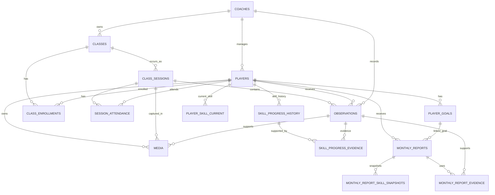

# PDS 전체 ERD / DB Schema v1.1

- 제품: Player Development System (PDS)
- 상태: MVP 개발 기준 확정안
- Frontend: Next.js (React)
- Backend: 별도 API / Service / Business Logic 계층
- Database: PostgreSQL
- Architecture: Hi5와 동일한 분리형 구조
- 연결 화면: Dashboard / Players / Player Detail / Classes / Class Log / Skill Ladder / Monthly Report
- 핵심 원칙: History First / Evidence Based / Backend Transaction / Soft Delete

---

# 1. 아키텍처 확정

```text
[ Next.js / React ]
        │
        │ HTTP / API
        ▼
[ Backend API ]
        │
        ├─ Authentication / Authorization
        ├─ Business Logic
        ├─ Validation
        ├─ Transaction
        ├─ AI Integration
        └─ File / Media Handling
        │
        ▼
[ PostgreSQL ]
```

## 역할 분리

### Frontend — Next.js
- 화면 렌더링
- 사용자 입력
- API 요청
- 클라이언트 상태
- 모바일 UX
- Report Preview

### Backend
- 인증 / 인가
- 입력 검증
- Player / Class / Observation CRUD
- Skill 변경 Transaction
- Monthly Report 승인 Transaction
- AI 호출
- Media 업로드 처리
- PDF / 이미지 생성
- PostgreSQL 접근

### PostgreSQL
- 선수
- 목표
- 클래스
- 실제 수업
- 출결
- 관찰
- Skill Current / History
- Media metadata
- Monthly Report
- Evidence / Snapshot

> Frontend에서 PostgreSQL에 직접 접근하지 않는다.

---

# 2. Supabase 종속 설계 제거

v1.0에서 사용했던 아래 항목은 제거한다.

- `auth.users`
- Supabase Auth 1:1 의존
- Supabase RLS 기반 권한 제어
- Supabase Storage 전제
- Signed URL을 특정 서비스 구현으로 고정
- `coach_id = auth.uid()` 정책

v1.1부터 인증, 권한, 파일 저장 방식은 Backend Infrastructure에서 결정한다.

DB는 순수 PostgreSQL Schema로 유지한다.

---

# 3. 최종 테이블 구성

## Account
1. `coaches`

## Player
2. `players`
3. `player_goals`

## Class
4. `classes`
5. `class_enrollments`
6. `class_sessions`
7. `session_attendance`

## Observation / Media
8. `observations`
9. `media`

## Skill
10. `player_skill_current`
11. `skill_progress_history`
12. `skill_progress_evidence`

## Monthly Report
13. `monthly_reports`
14. `monthly_report_skill_snapshots`
15. `monthly_report_evidence`

총 **15개 물리 테이블**.

---

# 4. 전체 ERD



---

# 5. 공통 DB 규칙

## Primary Key

PostgreSQL UUID 사용.

```sql
CREATE EXTENSION IF NOT EXISTS pgcrypto;

id uuid PRIMARY KEY DEFAULT gen_random_uuid()
```

## Timestamp

```text
created_at
updated_at
```

행동 시점은 별도 컬럼:

```text
observed_at
changed_at
approved_at
started_at
ended_at
```

## 삭제 정책

핵심 성장 기록은 Hard Delete를 기본 제공하지 않는다.

```text
Player       active / inactive
Class        active / archived
Enrollment   active / ended
Observation  is_void
```

---

# 6. coaches

PDS 사용자 계정의 도메인 데이터.

```sql
CREATE TABLE coaches (
    id uuid PRIMARY KEY DEFAULT gen_random_uuid(),

    email varchar(255) NOT NULL UNIQUE,
    name varchar(100) NOT NULL,

    status varchar(20) NOT NULL DEFAULT 'active'
        CHECK (status IN ('active', 'inactive')),

    created_at timestamptz NOT NULL DEFAULT now(),
    updated_at timestamptz NOT NULL DEFAULT now()
);
```

## 인증 관련 결정

비밀번호 해시 / OAuth Provider / Session Token 등의 인증 구현 데이터는
`coaches` 도메인 테이블에 억지로 넣지 않는다.

Backend 인증 방식 확정 시:

```text
auth_accounts
sessions
refresh_tokens
```

등을 별도 Infrastructure/Auth Schema로 확장할 수 있다.

---

# 7. players

```sql
CREATE TABLE players (
    id uuid PRIMARY KEY DEFAULT gen_random_uuid(),

    coach_id uuid NOT NULL
        REFERENCES coaches(id),

    name varchar(100) NOT NULL,

    birth_date date,
    grade varchar(30),

    throws varchar(10)
        CHECK (throws IN ('left','right','both') OR throws IS NULL),

    bats varchar(10)
        CHECK (bats IN ('left','right','switch') OR bats IS NULL),

    baseball_experience_months integer
        CHECK (baseball_experience_months >= 0),

    status varchar(20) NOT NULL DEFAULT 'active'
        CHECK (status IN ('active','inactive')),

    joined_at date NOT NULL DEFAULT CURRENT_DATE,
    inactive_at date,

    coach_note text,

    created_at timestamptz NOT NULL DEFAULT now(),
    updated_at timestamptz NOT NULL DEFAULT now()
);
```

## 저장하지 않는 값

```text
age
current_class_id
current_goal_text
```

각각 계산 또는 관계 조회로 가져온다.

---

# 8. player_goals

```sql
CREATE TABLE player_goals (
    id uuid PRIMARY KEY DEFAULT gen_random_uuid(),

    player_id uuid NOT NULL
        REFERENCES players(id),

    coach_id uuid NOT NULL
        REFERENCES coaches(id),

    title varchar(255) NOT NULL,
    description text,

    skill_area varchar(20)
        CHECK (
            skill_area IN (
                'catching',
                'throwing',
                'hitting',
                'baserunning'
            )
            OR skill_area IS NULL
        ),

    status varchar(20) NOT NULL DEFAULT 'active'
        CHECK (
            status IN (
                'active',
                'completed',
                'cancelled'
            )
        ),

    source varchar(30) NOT NULL DEFAULT 'manual'
        CHECK (
            source IN (
                'manual',
                'monthly_report'
            )
        ),

    source_report_id uuid,

    started_at date NOT NULL DEFAULT CURRENT_DATE,
    ended_at date,

    created_at timestamptz NOT NULL DEFAULT now(),
    updated_at timestamptz NOT NULL DEFAULT now()
);
```

선수당 Active Goal 1개:

```sql
CREATE UNIQUE INDEX uq_player_one_active_goal
ON player_goals(player_id)
WHERE status = 'active';
```

---

# 9. classes

반복되는 수업/반 정의.

```sql
CREATE TABLE classes (
    id uuid PRIMARY KEY DEFAULT gen_random_uuid(),

    coach_id uuid NOT NULL
        REFERENCES coaches(id),

    name varchar(150) NOT NULL,
    location varchar(255),

    day_of_week smallint
        CHECK (day_of_week BETWEEN 0 AND 6),

    start_time time,
    end_time time,

    capacity integer
        CHECK (capacity > 0),

    status varchar(20) NOT NULL DEFAULT 'active'
        CHECK (
            status IN (
                'active',
                'archived'
            )
        ),

    created_at timestamptz NOT NULL DEFAULT now(),
    updated_at timestamptz NOT NULL DEFAULT now()
);
```

MVP에서는 복잡한 RRULE Scheduler를 만들지 않는다.

---

# 10. class_enrollments

```sql
CREATE TABLE class_enrollments (
    id uuid PRIMARY KEY DEFAULT gen_random_uuid(),

    class_id uuid NOT NULL
        REFERENCES classes(id),

    player_id uuid NOT NULL
        REFERENCES players(id),

    status varchar(20) NOT NULL DEFAULT 'active'
        CHECK (
            status IN (
                'active',
                'ended'
            )
        ),

    enrolled_at date NOT NULL DEFAULT CURRENT_DATE,
    ended_at date,

    created_at timestamptz NOT NULL DEFAULT now(),
    updated_at timestamptz NOT NULL DEFAULT now()
);
```

```sql
CREATE UNIQUE INDEX uq_active_class_enrollment
ON class_enrollments(class_id, player_id)
WHERE status = 'active';
```

---

# 11. class_sessions

실제 특정 날짜의 수업.

```sql
CREATE TABLE class_sessions (
    id uuid PRIMARY KEY DEFAULT gen_random_uuid(),

    class_id uuid NOT NULL
        REFERENCES classes(id),

    coach_id uuid NOT NULL
        REFERENCES coaches(id),

    session_date date NOT NULL,

    scheduled_start_at timestamptz,
    scheduled_end_at timestamptz,

    started_at timestamptz,
    ended_at timestamptz,

    status varchar(20) NOT NULL DEFAULT 'scheduled'
        CHECK (
            status IN (
                'scheduled',
                'in_progress',
                'completed',
                'cancelled'
            )
        ),

    session_note text,

    created_at timestamptz NOT NULL DEFAULT now(),
    updated_at timestamptz NOT NULL DEFAULT now()
);
```

```sql
CREATE UNIQUE INDEX uq_class_session_date
ON class_sessions(class_id, session_date);
```

---

# 12. session_attendance

```sql
CREATE TABLE session_attendance (
    id uuid PRIMARY KEY DEFAULT gen_random_uuid(),

    session_id uuid NOT NULL
        REFERENCES class_sessions(id),

    player_id uuid NOT NULL
        REFERENCES players(id),

    status varchar(20) NOT NULL DEFAULT 'present'
        CHECK (
            status IN (
                'present',
                'absent',
                'late',
                'excused'
            )
        ),

    note text,

    created_at timestamptz NOT NULL DEFAULT now(),
    updated_at timestamptz NOT NULL DEFAULT now(),

    UNIQUE(session_id, player_id)
);
```

Enrollment과 별도로 두는 이유:

**Session 당시 실제 수업 대상자/출결 Snapshot을 보존하기 위해서다.**

---

# 13. observations

PDS 핵심 원본 데이터.

```sql
CREATE TABLE observations (
    id uuid PRIMARY KEY DEFAULT gen_random_uuid(),

    session_id uuid NOT NULL
        REFERENCES class_sessions(id),

    player_id uuid NOT NULL
        REFERENCES players(id),

    coach_id uuid NOT NULL
        REFERENCES coaches(id),

    skill_area varchar(20) NOT NULL
        CHECK (
            skill_area IN (
                'catching',
                'throwing',
                'hitting',
                'baserunning'
            )
        ),

    observation_text text NOT NULL,

    attempts integer
        CHECK (attempts >= 0),

    successes integer
        CHECK (successes >= 0),

    coach_note text,

    observed_at timestamptz NOT NULL DEFAULT now(),

    source varchar(20) NOT NULL DEFAULT 'manual'
        CHECK (
            source IN (
                'manual',
                'voice_ai'
            )
        ),

    is_void boolean NOT NULL DEFAULT false,

    created_at timestamptz NOT NULL DEFAULT now(),
    updated_at timestamptz NOT NULL DEFAULT now(),

    CHECK (
        successes IS NULL
        OR attempts IS NULL
        OR successes <= attempts
    )
);
```

## 핵심 원칙

```text
Observation = 관찰 사실
Skill Progress = 코치 판단
```

Class Log 저장으로 Skill Level을 자동 변경하지 않는다.

---

# 14. media

DB에는 파일 자체가 아니라 Metadata를 저장한다.

```sql
CREATE TABLE media (
    id uuid PRIMARY KEY DEFAULT gen_random_uuid(),

    player_id uuid NOT NULL
        REFERENCES players(id),

    coach_id uuid NOT NULL
        REFERENCES coaches(id),

    session_id uuid
        REFERENCES class_sessions(id),

    observation_id uuid
        REFERENCES observations(id),

    skill_area varchar(20)
        CHECK (
            skill_area IN (
                'catching',
                'throwing',
                'hitting',
                'baserunning'
            )
            OR skill_area IS NULL
        ),

    media_type varchar(20) NOT NULL
        CHECK (
            media_type IN (
                'photo',
                'video'
            )
        ),

    storage_provider varchar(50),
    storage_key text NOT NULL,

    mime_type varchar(100),
    file_size bigint,

    captured_at timestamptz NOT NULL DEFAULT now(),

    caption text,

    created_at timestamptz NOT NULL DEFAULT now()
);
```

## v1.0 대비 변경

기존:

```text
storage_bucket
storage_path
```

에서 보다 범용적인:

```text
storage_provider
storage_key
```

로 변경한다.

예:

```text
storage_provider = "s3"
storage_key = "players/{player_id}/2026/09/xxx.mp4"
```

Backend가 실제 URL 생성과 접근 권한을 담당한다.

---

# 15. player_skill_current

```sql
CREATE TABLE player_skill_current (
    player_id uuid NOT NULL
        REFERENCES players(id),

    skill_area varchar(20) NOT NULL
        CHECK (
            skill_area IN (
                'catching',
                'throwing',
                'hitting',
                'baserunning'
            )
        ),

    current_level smallint
        CHECK (
            current_level BETWEEN 1 AND 4
            OR current_level IS NULL
        ),

    criteria_version varchar(20) NOT NULL DEFAULT 'v1',

    updated_by uuid
        REFERENCES coaches(id),

    updated_at timestamptz NOT NULL DEFAULT now(),

    PRIMARY KEY(player_id, skill_area)
);
```

---

# 16. skill_progress_history

```sql
CREATE TABLE skill_progress_history (
    id uuid PRIMARY KEY DEFAULT gen_random_uuid(),

    player_id uuid NOT NULL
        REFERENCES players(id),

    coach_id uuid NOT NULL
        REFERENCES coaches(id),

    skill_area varchar(20) NOT NULL
        CHECK (
            skill_area IN (
                'catching',
                'throwing',
                'hitting',
                'baserunning'
            )
        ),

    previous_level smallint
        CHECK (
            previous_level BETWEEN 1 AND 4
            OR previous_level IS NULL
        ),

    new_level smallint NOT NULL
        CHECK (
            new_level BETWEEN 1 AND 4
        ),

    reason text,
    note text,

    criteria_version varchar(20) NOT NULL DEFAULT 'v1',

    changed_at timestamptz NOT NULL DEFAULT now(),

    created_at timestamptz NOT NULL DEFAULT now()
);
```

허용:

```text
NULL → 3
2 → 3
3 → 2
2 → 4
```

동일값 변경은 History를 만들지 않는다.

---

# 17. skill_progress_evidence

```sql
CREATE TABLE skill_progress_evidence (
    skill_progress_id uuid NOT NULL
        REFERENCES skill_progress_history(id)
        ON DELETE CASCADE,

    observation_id uuid NOT NULL
        REFERENCES observations(id),

    PRIMARY KEY(
        skill_progress_id,
        observation_id
    )
);
```

Skill 판단이 어떤 Observation을 근거로 했는지 추적한다.

---

# 18. monthly_reports

```sql
CREATE TABLE monthly_reports (
    id uuid PRIMARY KEY DEFAULT gen_random_uuid(),

    player_id uuid NOT NULL
        REFERENCES players(id),

    coach_id uuid NOT NULL
        REFERENCES coaches(id),

    year_month date NOT NULL,

    report_number integer,

    status varchar(20) NOT NULL DEFAULT 'not_started'
        CHECK (
            status IN (
                'not_started',
                'draft',
                'approved'
            )
        ),

    discovery_text text,
    current_focus_text text,
    next_goal_text text,
    home_training_text text,
    coach_message text,

    before_media_id uuid
        REFERENCES media(id),

    after_media_id uuid
        REFERENCES media(id),

    previous_goal_id uuid
        REFERENCES player_goals(id),

    next_goal_id uuid
        REFERENCES player_goals(id),

    ai_draft_generated_at timestamptz,

    approved_at timestamptz,

    approved_by uuid
        REFERENCES coaches(id),

    approved_snapshot jsonb,

    created_at timestamptz NOT NULL DEFAULT now(),
    updated_at timestamptz NOT NULL DEFAULT now(),

    UNIQUE(player_id, year_month)
);
```

`year_month`은 해당 월의 1일을 저장.

예:

```text
2026-09-01
```

---

# 19. monthly_report_skill_snapshots

```sql
CREATE TABLE monthly_report_skill_snapshots (
    id uuid PRIMARY KEY DEFAULT gen_random_uuid(),

    report_id uuid NOT NULL
        REFERENCES monthly_reports(id)
        ON DELETE CASCADE,

    skill_area varchar(20) NOT NULL
        CHECK (
            skill_area IN (
                'catching',
                'throwing',
                'hitting',
                'baserunning'
            )
        ),

    start_level smallint
        CHECK (
            start_level BETWEEN 1 AND 4
            OR start_level IS NULL
        ),

    end_level smallint
        CHECK (
            end_level BETWEEN 1 AND 4
            OR end_level IS NULL
        ),

    end_criterion_text text,

    criteria_version varchar(20) NOT NULL DEFAULT 'v1',

    created_at timestamptz NOT NULL DEFAULT now(),

    UNIQUE(report_id, skill_area)
);
```

---

# 20. monthly_report_evidence

```sql
CREATE TABLE monthly_report_evidence (
    report_id uuid NOT NULL
        REFERENCES monthly_reports(id)
        ON DELETE CASCADE,

    observation_id uuid NOT NULL
        REFERENCES observations(id),

    section_type varchar(30) NOT NULL
        CHECK (
            section_type IN (
                'discovery',
                'current_focus',
                'next_goal',
                'home_training',
                'coach_message'
            )
        ),

    created_at timestamptz NOT NULL DEFAULT now(),

    PRIMARY KEY(
        report_id,
        observation_id,
        section_type
    )
);
```

---

# 21. Circular FK 처리

`player_goals.source_report_id`는 `monthly_reports` 생성 이후 추가한다.

```sql
ALTER TABLE player_goals
ADD CONSTRAINT fk_player_goals_source_report
FOREIGN KEY (source_report_id)
REFERENCES monthly_reports(id);
```

---

# 22. 권한 처리 방식

v1.1에서는 DB RLS가 아니라 Backend Authorization을 기준으로 한다.

예:

```text
Request
→ Access Token / Session 검증
→ 로그인 Coach 확인
→ Resource ownership 검증
→ Service 실행
→ PostgreSQL
```

Backend는 요청에서 받은 `coach_id`를 그대로 신뢰하지 않는다.

예:

```text
GET /api/players/:playerId
```

처리:

```text
authenticatedCoachId
→ player 조회
→ player.coach_id === authenticatedCoachId 확인
→ response
```

---

# 23. Backend Transaction — Skill 변경

Frontend에서 아래 DB 작업을 각각 호출하면 안 된다.

```text
PATCH current skill
POST history
POST evidence
```

대신 하나의 Use Case:

```text
POST /api/players/:playerId/skills/:skillArea/change
```

Backend:

```text
BEGIN

1. Current Skill SELECT
2. Skill Progress History INSERT
3. Evidence INSERT
4. Current Skill UPSERT

COMMIT
```

실패:

```text
ROLLBACK
```

---

# 24. Backend Transaction — Monthly Report 승인

```text
POST /api/reports/:reportId/approve
```

Backend:

```text
BEGIN

1. Draft Validation
2. Skill Snapshot 확정
3. Evidence 확정
4. Approved Snapshot 생성
5. Report status = approved
6. approved_at / approved_by
7. 기존 active Goal 종료 (선택 시)
8. Next Goal INSERT
9. Report next_goal_id 연결

COMMIT
```

---

# 25. Backend Transaction — Class Log

```text
POST /api/sessions/:sessionId/players/:playerId/observations
```

Backend:

```text
1. Authentication
2. Session ownership 확인
3. Attendance 확인
4. Observation Validation
5. Observation INSERT
6. Media 연결
7. Response
```

Class Log 저장은 Skill Level을 변경하지 않는다.

---

# 26. Media 처리

권장 흐름:

```text
Next.js
   │
   │ upload request
   ▼
Backend
   │
   ├─ 파일 검증
   ├─ 권한 확인
   ├─ Storage 업로드
   └─ media metadata INSERT
```

DB에는 실제 Storage 구현과 독립적인 key를 저장한다.

```text
storage_provider
storage_key
```

따라서 향후:

```text
S3
Cloudflare R2
Vercel Blob
기타 Object Storage
```

중 하나를 선택해도 ERD를 크게 바꿀 필요가 없다.

---

# 27. AI 처리 위치

AI는 Backend에서 호출한다.

```text
Next.js
→ Backend
→ PostgreSQL에서 Evidence 조회
→ AI API
→ Structured Draft
→ Backend Validation
→ Draft 저장
→ Next.js
```

Frontend가 직접 AI API Key를 사용하지 않는다.

AI가 DB를 직접 수정하지 않는다.

---

# 28. Dashboard Query

별도 Analytics Table을 만들지 않는다.

### 오늘 수업
```text
class_sessions
+ classes
```

### 기록 완료
```text
present / late attendance
중 observation 존재 선수
```

### 미작성
```text
present / late
AND observation = 0
```

### Monthly Report
```text
approved / report eligible players
```

---

# 29. 주요 Index

```sql
CREATE INDEX idx_players_coach_status_name
ON players(coach_id, status, name);

CREATE INDEX idx_class_sessions_coach_date
ON class_sessions(coach_id, session_date);

CREATE INDEX idx_observations_player_date
ON observations(player_id, observed_at DESC)
WHERE is_void = false;

CREATE INDEX idx_observations_player_skill_date
ON observations(player_id, skill_area, observed_at DESC)
WHERE is_void = false;

CREATE INDEX idx_observations_session_player
ON observations(session_id, player_id)
WHERE is_void = false;

CREATE INDEX idx_media_player_date
ON media(player_id, captured_at DESC);

CREATE INDEX idx_skill_history_player_skill_date
ON skill_progress_history(
    player_id,
    skill_area,
    changed_at DESC
);

CREATE INDEX idx_reports_coach_month_status
ON monthly_reports(
    coach_id,
    year_month,
    status
);
```

---

# 30. API Resource Mapping

```text
/api/auth

/api/players
/api/players/:playerId
/api/players/:playerId/goals
/api/players/:playerId/skills
/api/players/:playerId/media
/api/players/:playerId/reports

/api/classes
/api/classes/:classId
/api/classes/:classId/enrollments

/api/sessions
/api/sessions/:sessionId
/api/sessions/:sessionId/attendance
/api/sessions/:sessionId/observations

/api/reports
/api/reports/:reportId
/api/reports/:reportId/generate-draft
/api/reports/:reportId/approve
/api/reports/:reportId/export
```

이 목록은 URL 최종 명세가 아니라 ERD와 Backend Resource의 대응 기준이다.

---

# 31. Frontend에서 하지 않을 것

Next.js Client Component에서 직접:

```text
PostgreSQL Query
Skill History INSERT
Goal 교체
Report Approve DB 변경
AI Secret Key 호출
Storage Secret 사용
```

을 하지 않는다.

모두 Backend Use Case를 통과한다.

---

# 32. MVP 무결성 규칙

1. Player당 active Goal 최대 1개.
2. Class/Player active Enrollment 중복 금지.
3. Session/Player Attendance 중복 금지.
4. successes > attempts 금지.
5. Class Log로 Skill 자동 변경 금지.
6. Player+Skill Current row 최대 1개.
7. Skill 변경 시 History 생성.
8. Skill History 덮어쓰기 금지.
9. Player+Month Report 1개.
10. Draft는 Report 완료로 계산하지 않음.
11. Approved Report Snapshot 보존.
12. Media 없이 Report 승인 가능.
13. Player inactive 시 History 유지.
14. Goal 변경 시 기존 Goal History 유지.
15. AI는 기존 Evidence를 기반으로만 초안 생성.
16. 복합 상태 변경은 Backend Transaction으로 처리.
17. Frontend가 DB를 직접 수정하지 않음.

---

# 33. 화면 ↔ Backend ↔ DB

| 화면 | Backend 주요 Use Case | DB |
|---|---|---|
| Dashboard | 오늘 수업/미작성/리포트 집계 | sessions, attendance, observations, reports |
| Players | 선수 검색/필터 | players, enrollments, goals |
| Player Detail | 선수 성장 이력 조회 | goals, observations, skills, media, reports |
| Classes | 클래스/등록/Session 관리 | classes, enrollments, sessions |
| Class Log | 관찰 저장 | attendance, observations, media |
| Skill Ladder | Skill 변경 | current skill, history, evidence |
| Monthly Report | Draft/Approve/Export | reports, snapshots, evidence, goals |

---

# 34. 개발 순서

```text
1. PostgreSQL Migration
2. Backend DB Connection / ORM
3. Authentication
4. Player / Goal API
5. Class / Enrollment API
6. Session / Attendance API
7. Observation / Media API
8. Skill Transaction
9. Report Draft / Approval Transaction
10. Next.js 화면 연결
11. AI Draft
12. PDF / Image Export
```

---

# 35. 최종 확정 구조

```text
┌─────────────────────────────┐
│        Next.js / React      │
│ UI · Form · Mobile UX       │
└──────────────┬──────────────┘
               │ API
               ▼
┌─────────────────────────────┐
│          Backend            │
│ Auth                        │
│ Validation                  │
│ Business Logic              │
│ Transactions                │
│ AI                          │
│ Media                       │
└──────────────┬──────────────┘
               │ SQL / ORM
               ▼
┌─────────────────────────────┐
│        PostgreSQL           │
│                             │
│ Player                      │
│ Goal                        │
│ Class / Session             │
│ Observation                 │
│ Skill History               │
│ Media Metadata              │
│ Monthly Report              │
└─────────────────────────────┘
```

PDS의 핵심 데이터 Loop:

```text
Player
→ Goal
→ Class
→ Session
→ Observation
→ Skill / Media
→ Monthly Report
→ Next Goal
↺
```

이 v1.1을 이후 SQL Migration, Backend API 명세, Next.js 구현의 기준 ERD로 사용한다.